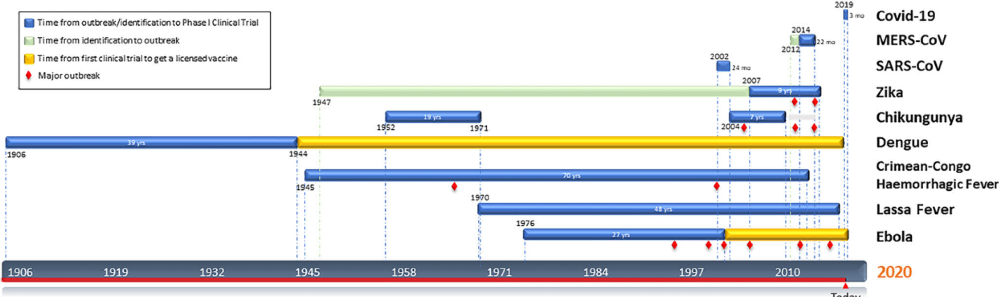

Consistently the section I despise writing up but in hindsight so valuable from learnings gained from all the amazing work done.

* Filtering 3K papers on the evolution and current state-of-the-art information retrieval to support biomedical research, 3 themes emerged: “applications supporting the fight against COVID-19”, “language modelling with neural networks for search”, and “information extraction from literature with alternatives to BERT”.

* Language modelling with semantic models (e.g., BERT) are better able to capture the meaning of complex biomedical questions than traditional lexical models such as BM25.

* Papers indicate additional performance is gained from training and fine-tuning to calibrate models to the target domain. 

* The Moderna (RNA platform) COVID-19 vaccine candidate (NCT04283461) entered phase 1 testing for safety just 69 days after the identification of Sars-CoV-2. By comparison, the first vaccine for Mers-CoV (NCT02670187) and Sars-CoV (NCT00099463) took 22 and 24 months respectively to reach clinical trials. In starker contrast, an Ebola vaccine, developed by the Public Health Agency of Canada and sub-licensed to Merck (NCT02344407), took five years to get approved following the 2014 outbreak in West Africa (Beigel et al., 2017, FDA, 2020).

