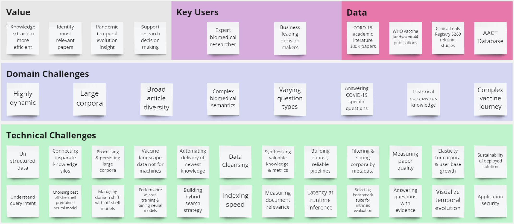
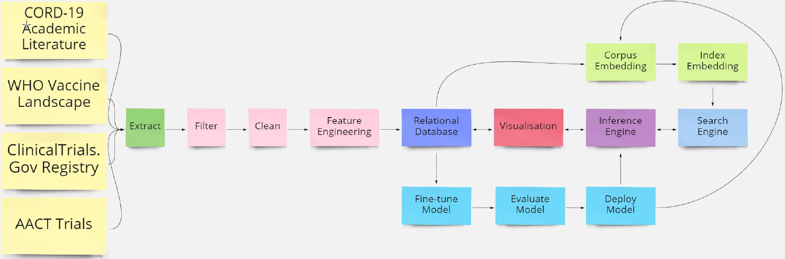
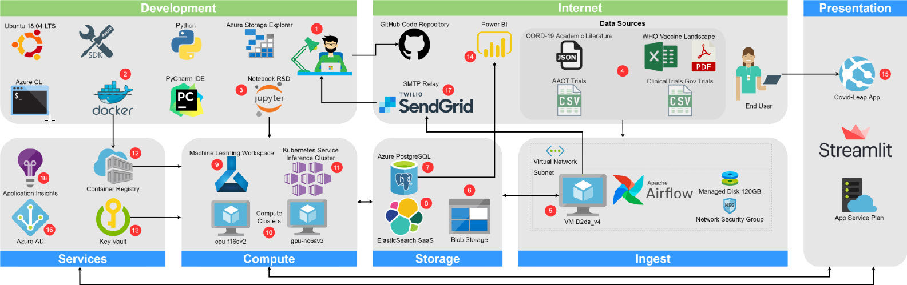

Consolidating the key discoveries and learnings from the literature review and dataset evaluation, I compiled a problem discovery canvas to understand the current situation: __large corpus__, __unstructured__, __complex__, __questions styles of questions__, __technical challenges__

I then mapped out the problems to a solution process flow:

Finally, I translate the problems into a cohesive solution, with developer tooling alongside selected hardware, software, and cloud infrastructure

