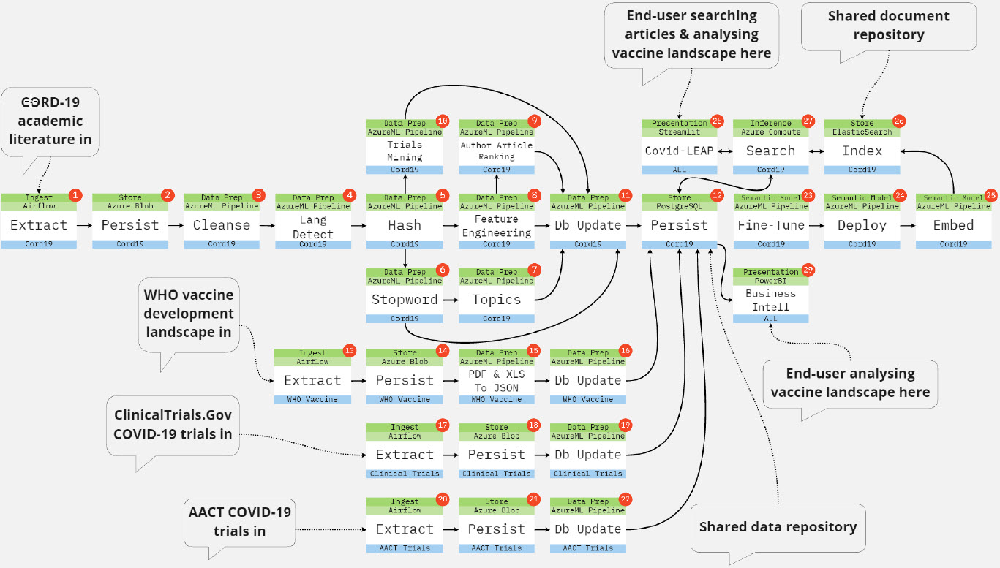

At its core, COVID-LEAP is a semantic information retrieval system. It is tasked with finding the most relevant academic paper snippets within a large open-source knowledge base of biomedical literature to answer human natural language form questions. 

I decomposed the problem of extracting knowledge to support clinical research into a step-by-step process. Language texts and trials data flow in, are processed through several data engineering and modelling tasks (developed in Python), and prepared data flows out to storage for applications to consume via an inference web service and database connection.

I used the Azure Machine Learning service framework to author, publish, orchestrate and monitor the pipelines.