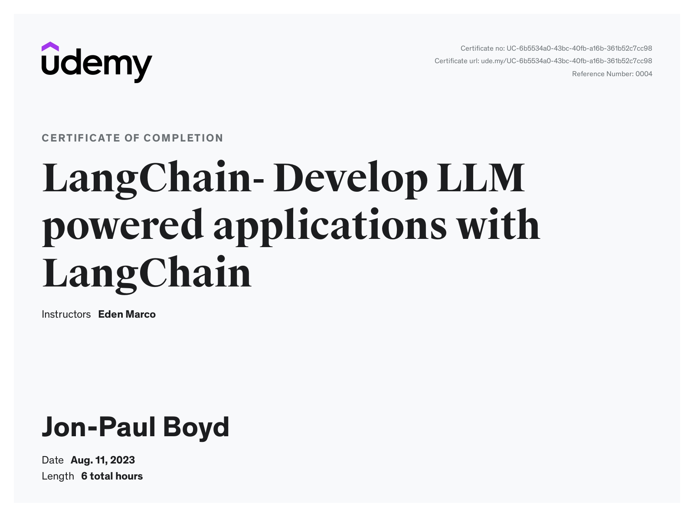

🎉 Brushed up on some LangChain, completing a nice [Udemy course](https://www.udemy.com/course/langchain/).\
 
📚 Key concepts including chains, agents, parsers, retrievers, memory, and prompting methods clearly explained, with the knowledge applied to fun hands-on projects.\
 
🙏 Thank you Eden Marco

