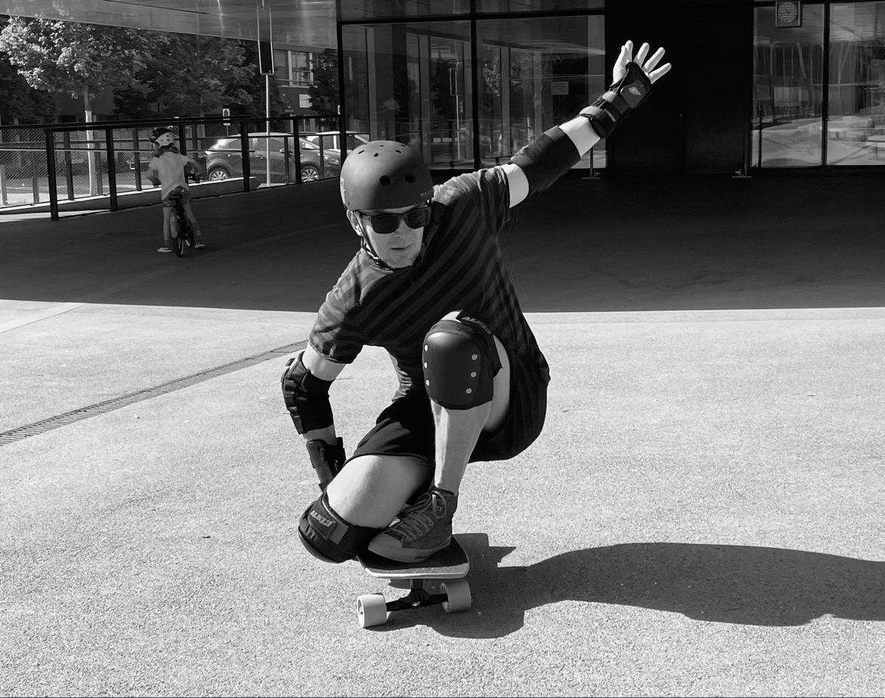

🏋️‍♀️ A fun yet intense week industrialising an LLM-driven app for customer recommendations alongside continuous learning and life stuff.

💥 With a focus on AI-based solutions and explosion of related tech, it’s challenging to keep up but also disconnect.

🕊️ It’s still summer. Get outside. Take holidays. Spend quality time with loved ones. Look after you. Hanging out at the park with my kids. Peace

