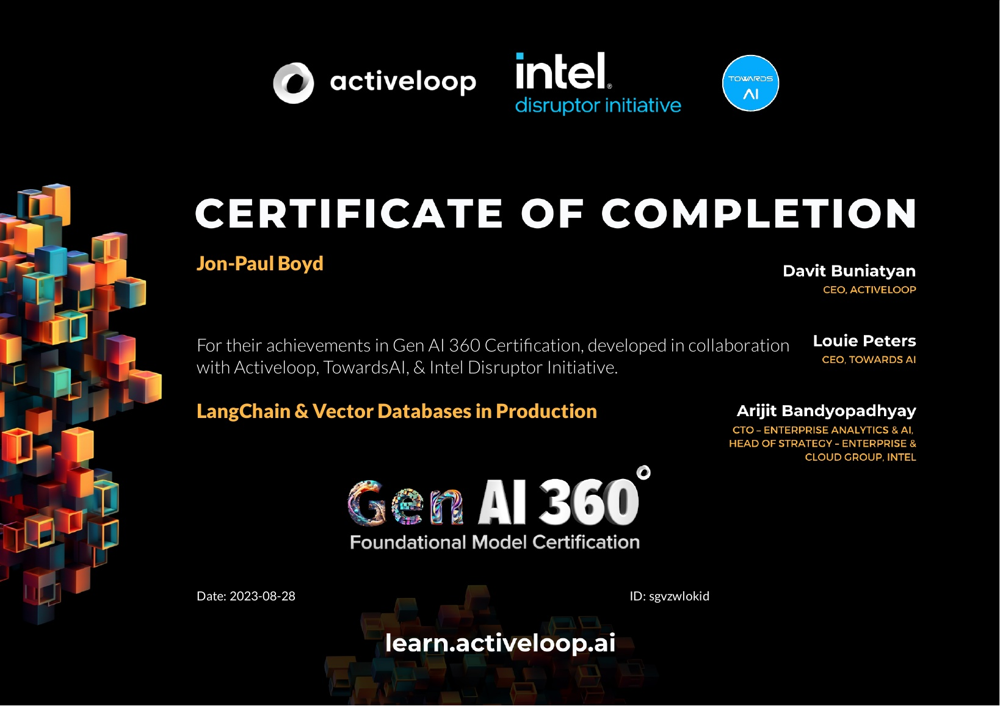

⚡️ Supercharged my learning with another LangChain course completed. 8 days of early starts, night sessions, one weekend, and 70(!) Python scripts later!

🖥 3 new learnings I'll be taking to work:

💥 Using SemanticSimilarityExampleSelector to inject learning examples semantically similar to user input into n-shot prompts. Optimizes in-context learning. Examples could be retrieved from vector store.

💥 ConstitutionalPrinciple chains to ensure model response adheres to use case ethics, expectations, and guidelines.

💥 Options for conversational memory management (ConversationSummaryMemory, vector store etc.), and factors to consider including conversation length, model token limits, and any need to maintain the full conversation history.

🙏 Thank-you Mikayel Harutyunyan and Activeloop for such a great, comprehensive, and FREE (yep) (course)[https://learn.activeloop.ai/courses/langchain]. The 100% pass rate on each section quiz was cruel 😈 but your Deep Lake multi-modal dB so 🔥

🚀 Completed just in time for Bethesda Game Studios Starfield, phew!

