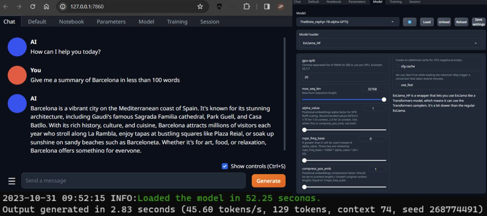

🚀 Open-source rocks! Blown away by Zephyr 7B & what this tiny model is capable of.

🔓 Proprietary LLM APIs e.g., GPT-4 are impressive, no doubt. However, for a personal project involving a family-engaging assistant, with access to home automation & private data, I'm excited about open-source LLMs, for privacy & cost.

🎲 Given the need for model trust, I've been playing with self-hosting LLMs to eval output quality & speed. However, GPU VRAM is king, hence interest in looking at 7B models that can fully load into a single consumer grade RTX3090 GPU (24GB). For comparison, a 70B model requires the combined VRAM of 2xRTX3090.

🔧 Oobabooga's text-generation-webui is a tool for running LLMs locally. A Web UI enables download & switching between models. Interface modes include chat & notebook to interact with a loaded model. Also features an API for websocket endpoint streaming. Go check it [here](https://github.com/oobabooga/text-generation-webui)

🤗 A nice touch: [model cards](https://huggingface.co/TheBloke/zephyr-7B-alpha-GPTQ) on Hugging Face detail using the model with text-generation-webui, along with example Python code to infer directly. ❤️

🧪 Opened text-generation-webui & loaded the compact, 4GB, 4-bit quantised Zephyr 7B Alpha GPTQ variant (smallest) into an RTX3090. Ran prompt "Give me a summary of Barcelona in less than 100 words". Output from both Zephyr 7B & GPT-4 below. Zephyr zipped along at 40 tokens/s, compared with GPT-4 at 8 tokens/s.

💭 Thoughts on Zephyr? Genuinely coherent, useful output. Fast enough for real-time chat. Use-case quality good enough for me. Lots of opportunities for gains with a framework around it including RAG & experimenting with affordable fine-tuning given model size.
 
📤Zephyr 7B
Barcelona is a vibrant city nestled on the Mediterranean coastline, boasting stunning architecture, rich cultural heritage, and delectable cuisine. It's home to masterpieces by Antoni Gaudí such as the iconic Sagrada Família, Park Güell, and Casa Batlló. The city's lively streets are filled with street performers, open-air markets, and delicious tapas bars. Barcelona is a paradise for football enthusiasts who flock to witness the legendary FC Barcelona team at Camp Nou stadium. With its sunny climate, breathtaking beaches, and welcoming locals, it's no wonder that Barcelona is one of Europe's most beloved destinations.

📤GPT-4
Barcelona, the capital of Catalonia, Spain, is renowned for its rich history, distinctive architecture, and vibrant culture. Famed architect Antoni Gaudí left a profound mark, with masterpieces like the Sagrada Família and Park Güell. The city boasts beautiful beaches, the bustling La Rambla promenade, and a world-class dining scene. As a hub of commerce, arts, and sports, Barcelona is also home to the iconic FC Barcelona football team. Its unique blend of Gothic and modernist charm makes it a top European destination.

