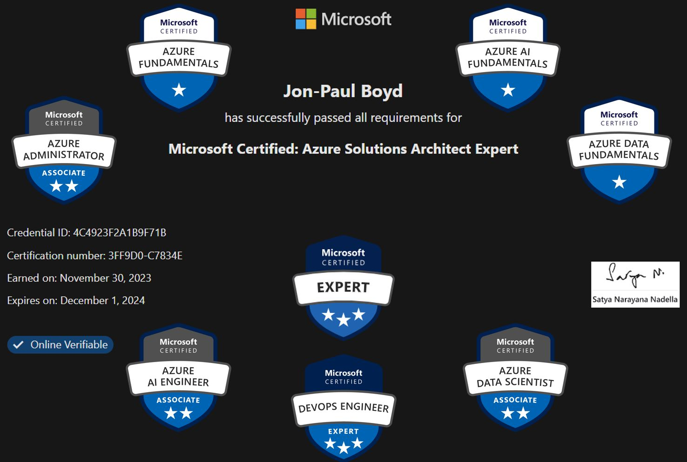

<!-- Original LinkedIn post: https://www.linkedin.com/posts/activity-7135936922459205633-GlSs -->
🎉 Another tough certification! Delighted to have passed Azure Solution Architect Expert, whoop!

🙏 Thank you Sandra Ohmayer & Ganesh Swaminathan at Lufthansa for the opportunities to work on OneAI & One Data Platform, which have been great knowledge building & learning experiences. Every day I learn from my wonderfully capable colleagues at Lufthansa Group. ❤️

🙏 Nordcloud, an IBM Company & Marcel Santos for providing the time, resources, & flexibility to follow my learning journey in a way that works for me. ❤️

🙏 My family (!) for putting up with my learning obsession, & supporting me with the time I need. ❤️

