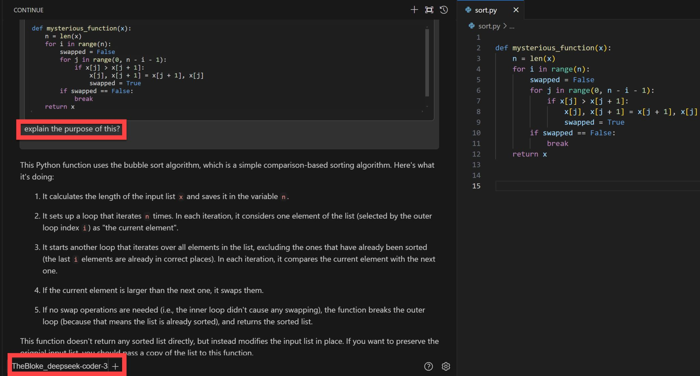

<!-- Original LinkedIn post: https://www.linkedin.com/posts/activity-7158204442121555969-_SVC -->

Did you know you can have that coding co-pilot experience in vscode with open source LLMs? 

[continue.dev](https://continue.dev/) is an extension that supports your coding tasks with any LLM served by any provider, including locally self-hosted, cloud-hosted, open-source and proprietary. 

Currently enjoying using it with DeepSeek-Coder-33B while awaiting quantised python versions of Mmeta's latest open-source awesomeness that is code-specialized versions of llama2. If you went for a quantised version of the 7B model, you could have an effective, locally hosted and offline coding partner for just 4GB of your VRAM.

