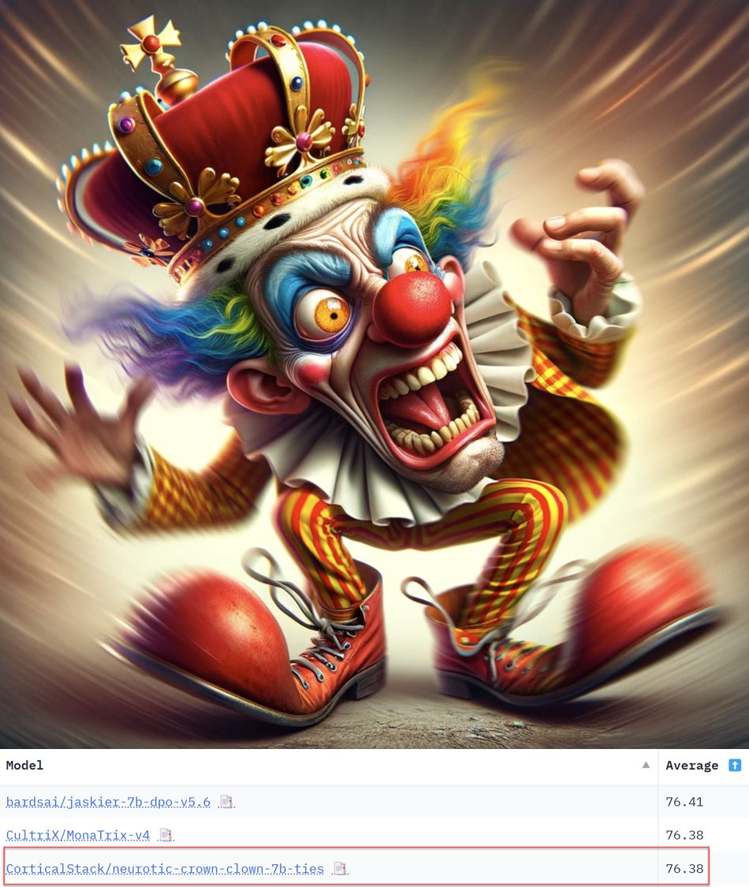

<!-- Original LinkedIn post: https://www.linkedin.com/posts/activity-7167133058775650304-9tZO -->

🧪 Model merging takes multiple LLMs and combines into one. It's cost-effective (no GPU needed), and can be done on consumer hardware.

🏆 Merging can result in SOTA models as evaluated on the Hugging Face Open LLM Leaderboard. My neurotic-crown-clown model just ranked 3rd (avg. 76.38) from thousands of 7B models on 🤗. Whoop! 

📖 Required absolutely no skill on my part, just time to read and try. As part of my learning journey, I worked through a [great blog on merging from Maxime Labonne](https://towardsdatascience.com/merge-large-language-models-with-mergekit-2118fb392b54). I really ❤️ the knowledge sharing mindset of the open source LLM community, this space is really special and a great place to be.

♟️ My strategy? Simple, build on the shoulders of giants with strong base models for the merge:
1. [NeuralMonarch](https://huggingface.co/mlabonne/NeuralMonarch-7B) by Maxime Labonne
2. [AlphaMonarch](https://huggingface.co/mlabonne/AlphaMonarch-7B) by Maxime Labonne 
3. [Jaskier-7b-dpo-v5.6](https://huggingface.co/bardsai/jaskier-7b-dpo-v5.6) from bards.ai

❓ As an aside, is merging merges becoming a way to game eval leaderboards?

[Neurotic-crown-clown](https://huggingface.co/CorticalStack/neurotic-crown-clown-7b-ties)
[Neurotic-crown-clown GGUF quantise](https://huggingface.co/CorticalStack/neurotic-crown-clown-7b-ties-gguf)
[Neurotic-crown-clown AWQ quantised](https://huggingface.co/CorticalStack/neurotic-crown-clown-7b-ties-awq)
[Neurotic-crown-clown EXL2 quantised](https://huggingface.co/CorticalStack/neurotic-crown-clown-7b-ties-6.5bpw-exl2)
[HF open LLM leaderboard](https://huggingface.co/spaces/HuggingFaceH4/open_llm_leaderboard)

