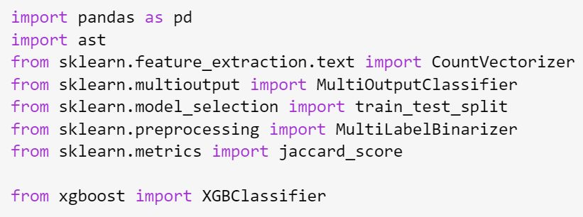

<!-- Original LinkedIn post: https://www.linkedin.com/posts/activity-7202336619784192002-QmL6 -->

⚠️ Reality check. LLMs are not always the optimal solution to every problem...

Working on a multi-label text classification use case. Prompting with GPT-4 beat GPT3.5 Turbo, but slow (4 hours, acc. 43%). Fine-tuned open source models bested the GPTs, with Mistral-7b v0.2 on top (2 mins, 64%).

👉 xgboost (remember that old flame? ❤️), acc. 66% in 1s. For sure it depends on dataset size & complexity. And perhaps some % can be squeezed out from LLM parameter tuning and longer training. But looking like xgboost captures the key signals more effectively based on the data provided. Simpler. Cheaper. Faster.

👀 Even these amazing LLMs need a reality check every once in a while.

