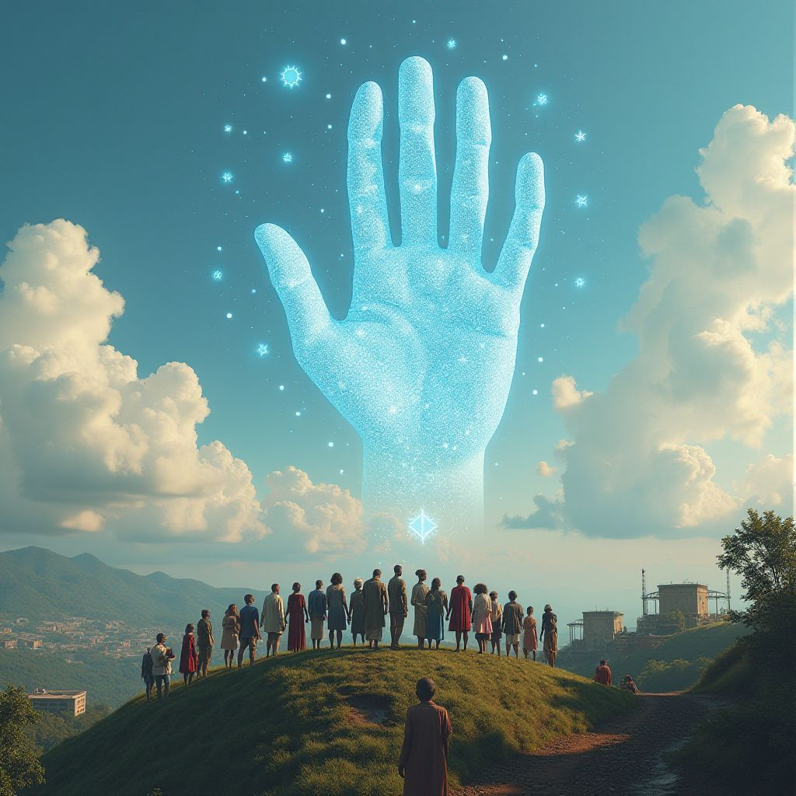

<!-- Original LinkedIn post: https://www.linkedin.com/posts/activity-7233086823525220352-_ADN -->

100% tech nerd here, self-hosting all the useful and cool GenAI models, and I love it! 💖

🙏 Every day, my feed explodes with the evolving AI landscape. New models like Llama3.1 and Flux. Techniques like model distillation. On-device generation. It just goes on, it's mind-blowing, exciting, and I'm grateful folks like Maxime Labonne, Philipp Schmid, and Sebastian Raschka, PhD share such great stuff to learn from.

🔥 But you know what I'd find refreshing? A burning question that I have? 

🌍 Where's the stories of AI transforming REAL lives? AI saving lives in hospitals. AI extending life. AI serving underprivileged communities. AI serving mental and physical wellbeing.

📢 I need to hear more of this everyday, quality impact to lives, not just labs. Would love you to share any stories of how AI is making a real difference, or good channels and people to follow for these. Thanks!

