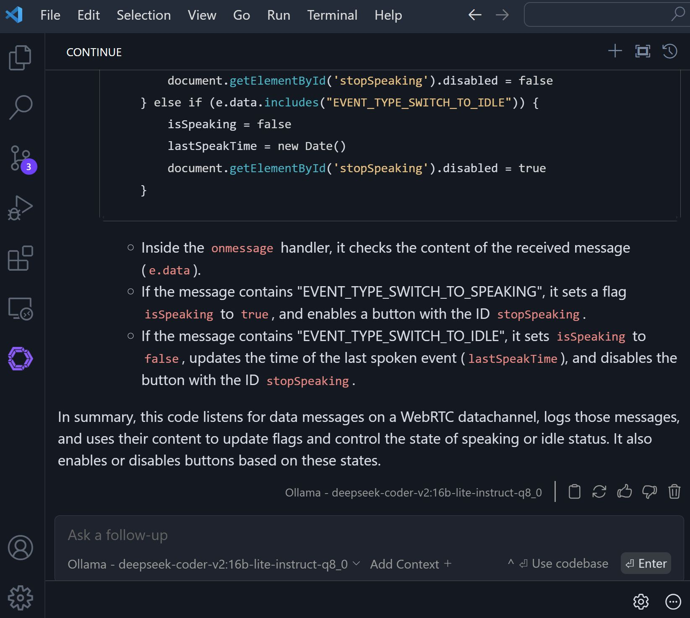

<!-- Original LinkedIn post: https://www.linkedin.com/posts/activity-7236294406713020416-ypXN -->

🤖 VS Code is my go-to IDE. Experienced with Python, but a recent, smaller project had me venturing into JavaScript, CSS, and HTML. Opportunity to compare some compatible AI coding assistants (which are here to stay)!

🤖 + 💻 GitHub Copilot

👉 Paid service, costing $10 p/m. 

👍 Tab autocomplete works well, for me the best autocomplete, maintains context well.

👎 Limited to OpenAI's GPT4 and Codex models.

➡️ Cursor

👉 Lots of buzz about [Cursor](https://www.cursor.com/), including from @Andrej Karpathy.

👉 Twice as expensive as Copilot, at $20 p/m for paid tier and access to OpenAI/Anthropic LLM completions. Or free if bringing your own closed provider API keys.

👍 Slick chat UI.

👍 IMO not so great maintaining context between questions.

👎 Couldn't get working with self-hosted LLM router.

👎 Looks identical to VS Code, but it's a fork. Don't want to get locked into this.

👎 Tab autocomplete only in paid tier!

⏩ Continue

👉 Maintains same VSCode functionality, it's just an [extension](https://www.continue.dev/).

👍Full control over model selection for chat text generation/autocomplete/embedding. Bring my own API keys for cloud hosted models, or

👍Seemlessly integrate self-hosted models!

👍Good context retention

For now, sticking with Continue, cancelling that GitHub Copilot sub.

