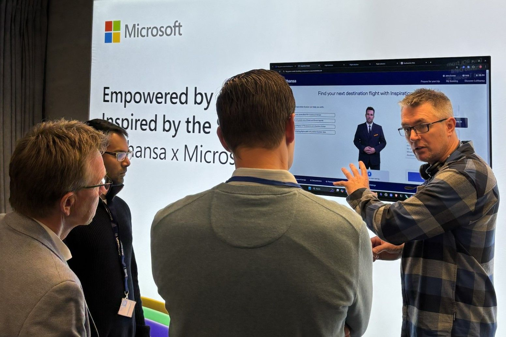

<!-- Original LinkedIn post: https://www.linkedin.com/posts/activity-7262192633492443136-7vZh -->

Stepped away from the keyboard today. Met actual humans. The horror 😱

But what a time at Lufthansa IT Supplier Tech Day, it blew my mind!

💗 Being embraced upon arrival by colleagues.

↳ Being trusted by IBM & Microsoft to present our inspiration avatar PoC to a wide audience.

↳ Living vicariously: hearing from Ganesh Swaminathan on how magical it was to showcase our PoC to Satya Nadella himself! ✨

↳ Inspiring minds & use cases by showing what fusing LLMs & agents with flights & customer data looks like.

↳ Talking with different teams but finding the same GenAI synergy potential & objectives.

↳ Found more tech tribes! Code & coffee chats inbound.

↳ Unexpected joy in hearing how much GenAI literacy already flows through Lufthansa & it's suppliers.

↳ MVP moment. Seeing Microsoft invest in talent. Kardelen Yüksel will learn so much & bring so much. She'll make waves of her own.

Working brings in the bread.

Days like today are sugar in life. Thank you Harry Becker & Michael Masa for the invite.

