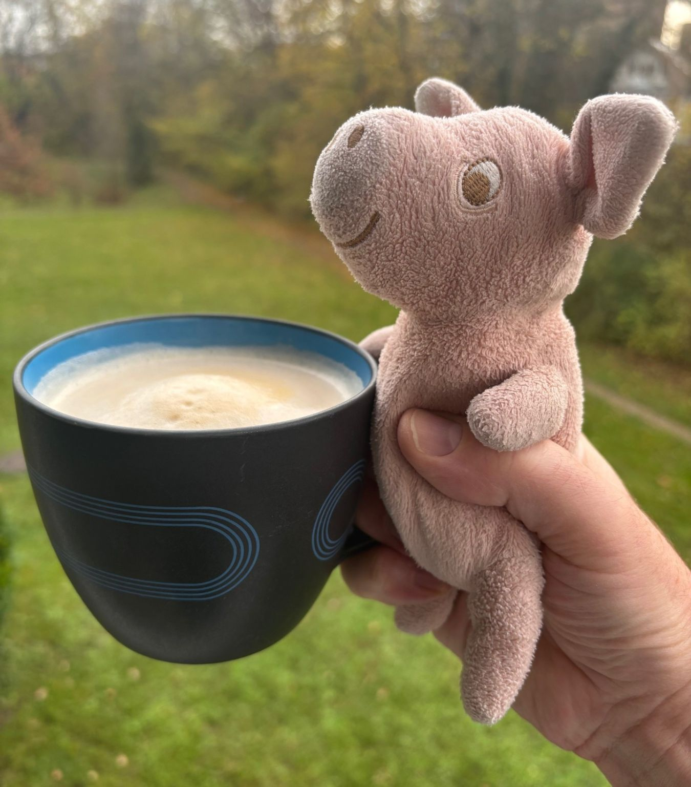

<!-- Original LinkedIn post: https://www.linkedin.com/posts/activity-7266389276173504512-JVkh -->

My feed usually full of AI innovation, VCs, the startup hustle. Today I'm thinking of something different. Working parents are amazing!

11PM last night. My daughter's constant coughing.

Quietly moved her to the spare room, letting my wife (full time worker) and other daughter sleep. Propped daughter up on pillows. Opened windows for humidity. Fetched cough syrup, water, and tissues for the night ahead.

I wrapped my arms around her. She coughed in my face. I didn't care. "I love you," she whispered.

2AM - She's finally asleep. Job done. I held her hand. She doesn't know it, but she comforts me more than I comfort her.

See that colleague next to you. The working parent. They are full of empathy and masters of communication and negotiation. They juggle worlds with time management. Resilience is their superpower. Their work ethic? Totally dedicated.

Today I'm tired but the coffee is good. It will be sofa snoozes and board games. It's the perfect Sunday. ❤️

