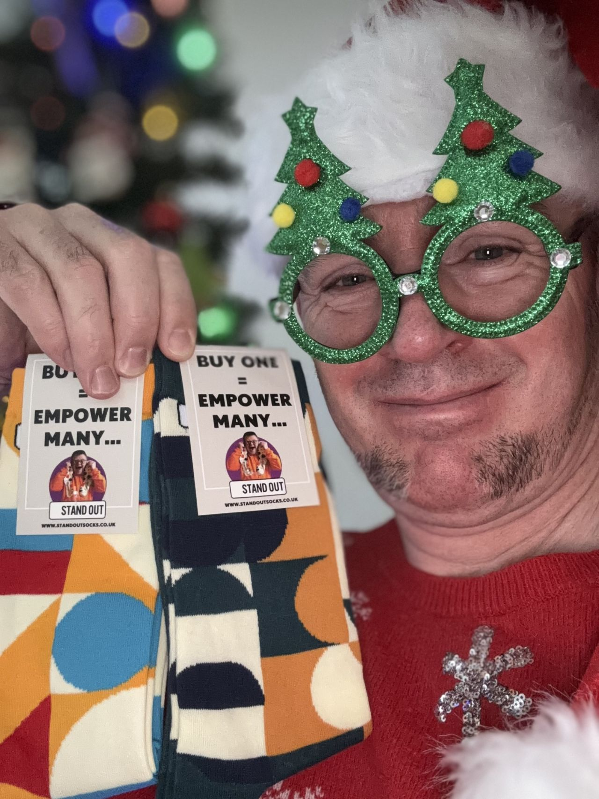

<!-- Original LinkedIn post: https://www.linkedin.com/posts/activity-7273635225782435840-jVRc -->

🚨 BREAKING: Dad's GPU dreams shattered as kids align with innovative British sock enterprise!

Snuggles McJingle (Santa's Chief Sock Officer) asked JP's girls: "Should Daddy get a spanking new Nvidia DGX GB200 or socks for Christmas?"

The little angels said SOCKS! When asked why, they said "Daddy's feet need love too". Fair.

But these are no ordinary socks. They are foot-hugging symbols of positive change, providing paid employment opportunities for individuals with Down Syndrome ❤️

For a next corporate or personal gift to warm feet AND hearts, go check out Stand Out Socks ✌️🧡🧦

(P.S. NVIDIA, JP's DMs remain open)

