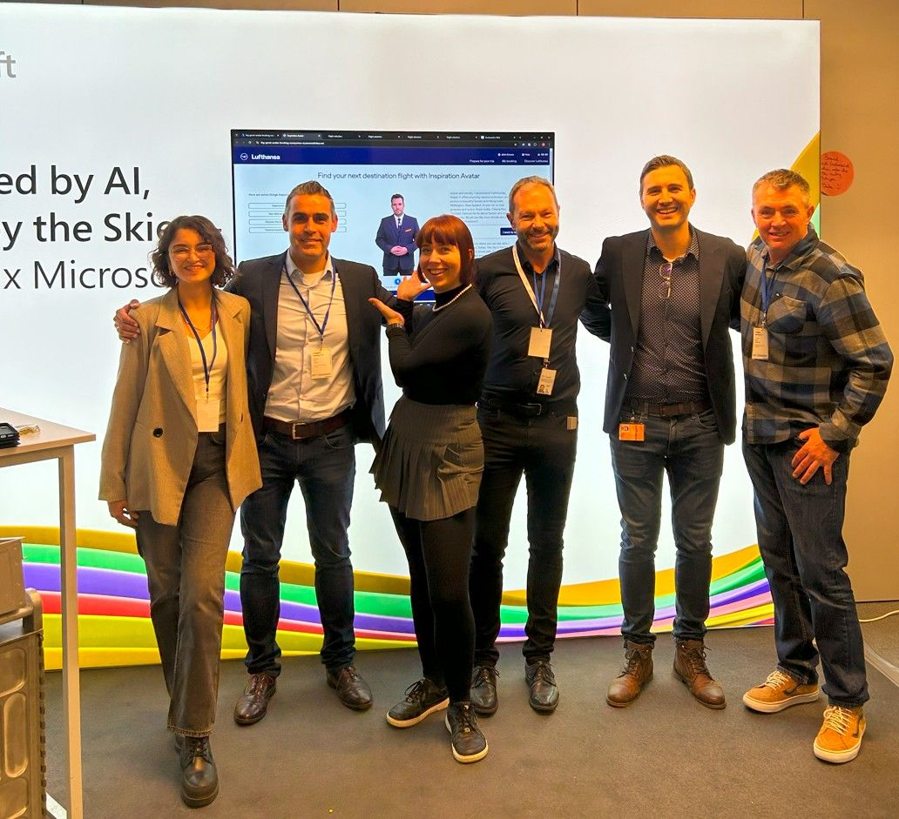
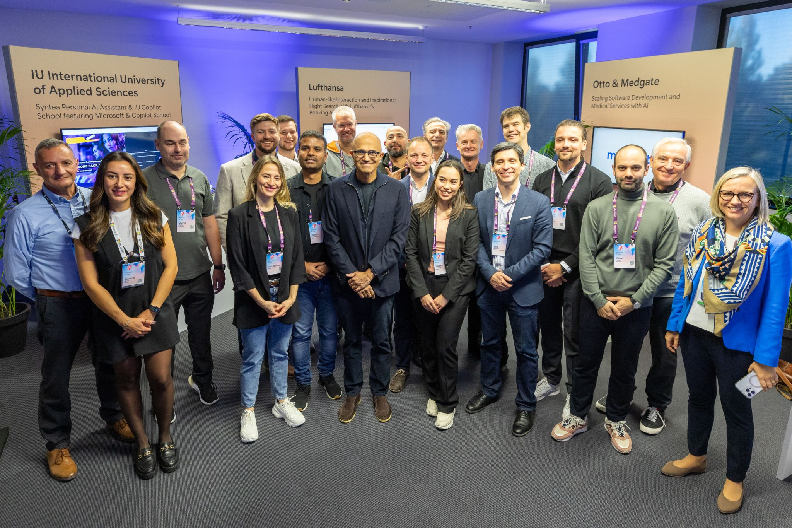

<!-- Original LinkedIn post: https://www.linkedin.com/posts/activity-7301155182069907456-le3l -->

Today is my last with Nordcloud, an IBM Company. Thank you for the wonderful opportunities to support Yarowa AG, Transcality, Logmind & domo.health on their Azure AI journey.

However, my heart is full when I think back on my time with Lufthansa. Thank you Ganesh Swaminathan for bringing me into the One Data Platform team, & Sandra Ohmayer for the chance to pursue my AI passion with OneAI. 

And to the GenAI team, what a privilege! A group of extremely curious & technically brilliant individuals who approach tasks with passion & hard work. Our discussions, even when we disagreed, always led to stronger outcomes, I loved them. Keep being an amazing, happy team, thank you. ❤️

As for Lufthansa, I've seen first-hand their relentless focus on the customer experience in everything they do. You showed me what striving for excellence looks like.

Life takes unexpected turns. Several years ago, I was rejected for a position at Microsoft, and rightfully so, I lacked the necessary experience. Thanks to all I've learned since, particularly at Lufthansa, I'm joining Microsoft Switzerland next week, continuing my passion for enabling customers to achieve their goals using data & AI.

