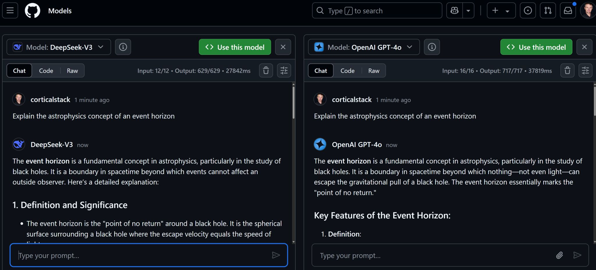
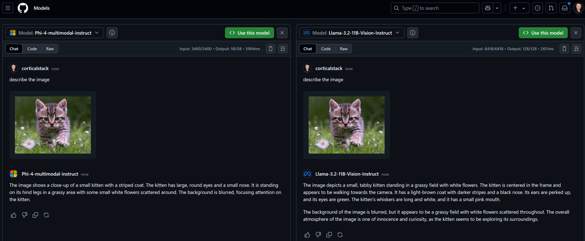

<!-- Original LinkedIn post: https://www.linkedin.com/posts/activity-7305519782911488000-FxQp -->

💡 Discovered a cool tool today for testing GenAI models! 

Beyond benchmark scores, [GitHub marketplace models](https://github.com/marketplace/models) lets you intuitively test models directly with your own prompts. For free. Hit the Compare button to see two models tackle the same prompt side-by-side. 

Even works with multi-modal models.

You can adjust and sync the system prompts and parameters.

Thanks to John Savill for sharing this tip in his [excellent hashtag#Azure AI Foundry overview](https://www.youtube.com/watch?v=Sq8Cq7RZM2o).

